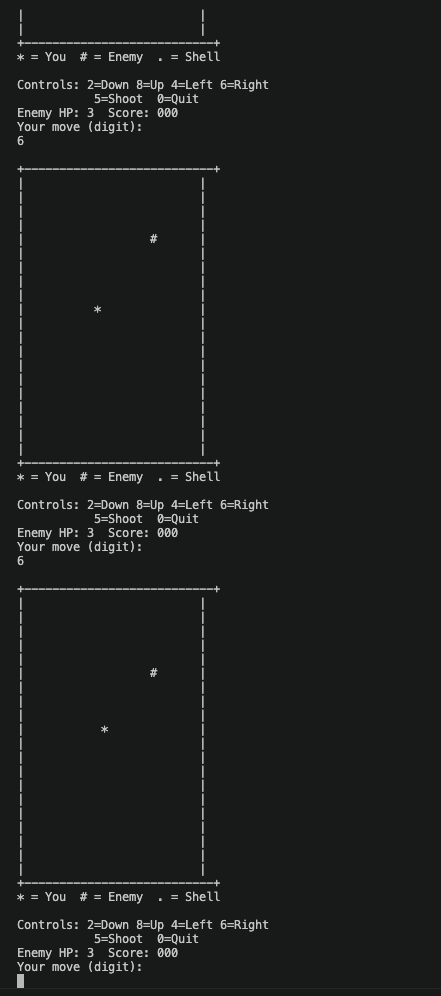
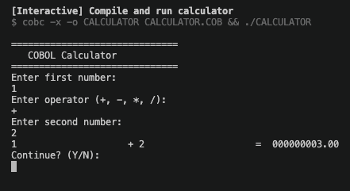

# COBOL Applications

## Tank Game



### How to run Tank Game

1. **Compile:**
   ```bash
   cobc -x -o TANK TANK.COB
   ```

2. **Run:**
   ```bash
   ./TANK
   ```

### Controls
| Key | Action |
|-----|--------|
| `8` | Move Up |
| `2` | Move Down |
| `4` | Move Left |
| `6` | Move Right |
| `5` | Shoot |
| `0` | Quit |

### Legend
- `*` — Your tank
- `#` — Enemy
- `.` — Shell

---

## Calculator



### How to run Calculator

1. **Compile:**
   ```bash
   cobc -x -o CALCULATOR CALCULATOR.COB
   ```

2. **Run:**
   ```bash
   ./CALCULATOR
   ```

### Example Session
```
==============================
   COBOL Calculator
==============================
Enter first number: 
10
Enter operator (+, -, *, /): 
+
Enter second number: 
5
10 + 5 = 15.00
Continue? (Y/N): 
Y

==============================
   COBOL Calculator
==============================
Enter first number: 
100
Enter operator (+, -, *, /): 
/
Enter second number: 
0
Error: Division by zero!
Continue? (Y/N): 
N

Goodbye!
```

### Features
- Basic arithmetic: `+`, `-`, `*`, `/`
- Division by zero protection
- Loop mode (continue after each calculation)
- Invalid operator handling

---

## Requirements

- [GnuCOBOL](https://gnucobol.sourceforge.io/) compiler

### Install GnuCOBOL (macOS)

```bash
brew install gnucobol
```

### Install GnuCOBOL (Linux - Debian/Ubuntu)

```bash
sudo apt install gnucobol
```
